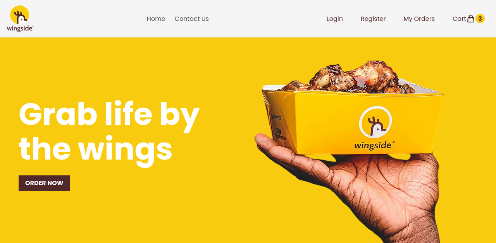

# Wingside-store Food App

An e-commerce application designed for ordering food.

## Screenshot

## Web version

- Visit [here](https://wingside-store.vercel.app/)

### Built with

- HTML
- SCSS
- Bulma CSS
- React JS
- JavaScript
- Supabase

### Getting Started with scaffolding this Project 

This project was bootstrapped with [Vite](https://github.com/vitejs/vite).

## Learn More

You can learn more in the [Vite documentation](https://vitejs.dev/guide/).

To learn React, check out the [React documentation](https://reactjs.org/).
